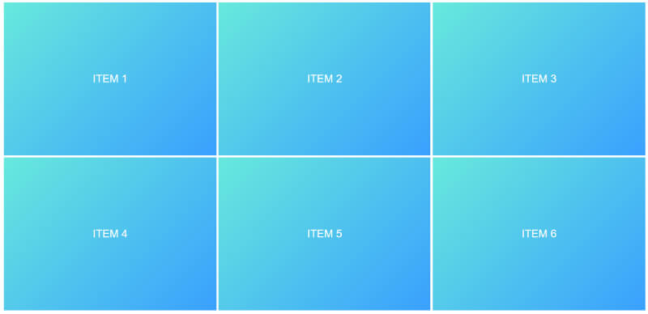
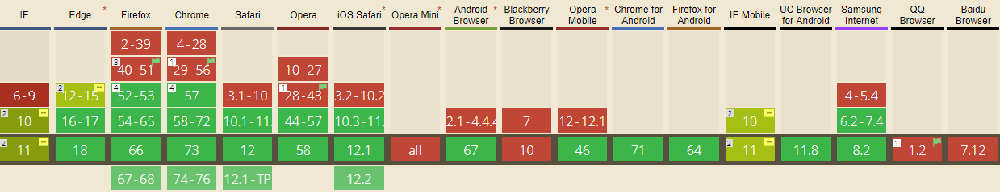

   Aprendiendo Css | Grid layout   

Grid Layout y cómo se utiliza
=============================

  

Empezando a utilizar Grid
-------------------------

A diferencia de Flexbox que sirve para posicionamientos en una sola dimensión, el posicionamiento en Grid permite la disposición de elementos en 2 dimensiones, logrando establecer los valores o espacios que ocuparan los elementos dentro de una composición.

  
  

Contenedor con grid
-------------------

Para activar la cuadrícula grid hay que determinar sobre el elemento contenedor la propiedad display y especificar el valor grid o inline-grid. Este valor determina como se comportará la cuadrícula con el contenido exterior. El primero permite que la cuadrícula aparezca encima/debajo del contenido exterior (en bloque) y el segundo de ellos permite que la cuadrícula se muestre de izquierda/derecha (en línea) del contenido exterior.

    
       
    
ITEM 1       
    
ITEM 2       
    
ITEM 3       
    
ITEM 4       
    
ITEM 5       
    
ITEM 6
      
    
  

    	.contenedor{
    	   display: grid;
    	 }
    
    	.item{
    	   background-color: #b4b8b9;
    	   border: 1px solid #ffffff;
    	   padding: 1rem;
    	   font-family: arial;
    	   color: white;
    	   text-align: center;
    	 }

Resultado:  

Establecer los valores
----------------------

Podemos observar que la disposición de los elementos no ha cambiado porque no hemos definido el numero de columnas que deberá ocupar nuestra grilla, esto lo podemos definir utilizando la propiedad grid-template-columns en distintas maneras:

Utilizando la unidad de medida fr, que permite establecer la cantidad de espacio que ocupara un elemento dentro del área disponible , es decir , 1 fr es igual a una parte del espacio disponible, de esta manera podemos definir el espacio de ocupara cada elemento y la cantidad de columnas que tendrá el espacio.

Por ejemplo:

    
    	display:grid;
    	grid-template-columns: 1fr 1fr 1fr;
    

    
    	grid-template-columns: 2fr 1fr 1fr;
    

En este caso la primera columna ocupara 2 veces mas que el resto de las columnas.  
Esta medida puede ser utilizada en unión con unidades de medidas fijas como px:

    
    	grid-template-columns: 200px 2fr 1fr;
    

Las medidas de la primera columna serán absolutas mientras que las que estén establecidas en fr serán flexibles.

    
    	.contenedor{
    	    display: grid;
    	    grid-template-columns: 200px 2fr 1fr;
    	    height: 500px;
    	  }
    	 
    	 .item{
    	    background-color: #b4b8b9;
    	    border: 1px solid #ffffff;
    	    padding: 1rem;
    	    font-family: arial;
    	    color: white;
    	    text-align: center;
    	  }
    

Resultado:  

Vista de la malla:  

Definiendo el numero de filas que tendrá nuestra malla:
-------------------------------------------------------

Determinaremos el numero de filas utilizando la propiedad grid-template-rows que puede ser utilizado igual que grid-template-columns, definiendolo en fr o medidas como px, rem, em vh o vw.

    
    	grid-template-rows: 1fr 1fr 1fr;
    

Ejemplo:

    
        
ITEM 1
        
ITEM 2
        
ITEM 3
        
ITEM 4
        
ITEM 5
        
ITEM 6
    	
      .contenedor{
    	   display: grid;
    	   height: 100vh; /*ocupa el alto de la pantalla*/
    	   grid-template-columns: repeat(3, 1fr); /*los elementos ocuparan 3 columnas*/
    	   grid-template-rows: repeat(2, 1fr);  /*los elementos ocuparan 2 filas*/
    	 }
    	
    	.item{
    	   border: 3px solid #ffffff;
    	   padding: 1rem;
    	   font-family: arial;
    	   color: white;
    	   text-align: center;
    	   background: linear-gradient(135deg, rgb(97, 234, 222) 0%, rgb(30, 168, 255) 100%);
    	   display: flex;
    	   justify-content: center;
    	   align-items: center;
    	   font-size: 2rem;
    	}
       

Resultado:  

Si aumentáramos la propiedad grid-template-rows: repeat(3, 1fr); a tres filas el resultado seria:  

También podremos establecer que algunas filas ocupen mayor espacio que otras

    grid-template-rows: repeat(1, 2fr) repeat(1, 1fr);`
    
  

A parte de poder establecer el numero de columnas y filas y del espacio que ocuparan cada una de ellas, también podremos establecer estos valores en cada celda individual, incluso superponiendo celdas con otras, esto lo podemos lograr con las propiedades:

\-grid-column-start: el lugar de inicio entre las columnas que ocupara esta celda o item.  
\-grid-column-end el lugar final entre las columnas que ocupara esta celda o item.  
\-grid-row-start: el lugar de inicio entre las filas que ocupara esta celda o item.  
\-grid-row-end el lugar final entre las filas que ocupara esta celda o item.

Por ejemplo, si establecimos que los valores de grid-template-columns: serian : 1fr 1fr 1fr 1fr; y los de  
grid-template-rows: serian: 1fr 1fr 1fr:

    
          

              
ITEM 1
              
ITEM 2
              
ITEM 3
              
ITEM 4
              
ITEM 5
              
ITEM 6
              
ITEM 7
              
ITEM 8
              
ITEM 9
        
        
        .contenedor{
            display: grid;
            grid-template-columns:  1fr 1fr 1fr 1fr;
            grid-template-rows: 1fr 1fr 1fr;
        }
        .one {
            grid-column-start: 1;
            grid-column-end: 3;
            grid-row-start: 1;
            grid-row-end: 3;
        }
        

Superposición de celdas:  

---------------------------

Con este método también podemos superponer celdas determinando la relevancia de cada uno mediante la propiedad z-index:

            .one {
                grid-column-start: 1;
                grid-column-end: 3;
                grid-row-start: 1;
                grid-row-end: 3;
              }
            .two {
                grid-column-start: 2;
                grid-column-end: 4;
                grid-row-start: 1;
                grid-row-end: 2;
              }
            

que seria lo mismo que:

              .one{
                grid-column: 1 / 3;
                grid-row: 1 / 3;
              }
              .two{
                grid-column: 2 / 4;
                grid-row: 1 / 2;
              }
              

Resultado:  

Denominando áreas de grilla
---------------------------

La propiedad grid-template-areas permite ponerle nombres a cada una de las celdas, determinado el espacio que ocuparan y la ubicación de estas. Podemos emplearlas de la siguiente manera:

    
      

            
HEADER
            
SIDEBAR
            
MAIN/div>
            
FOOTER
      
      .contenedor{
          display: grid;
          height: 98vh;
          grid-template-areas: "header header"
                               "siderbar  main"
                               "footer  footer";
          grid-template-rows: 80px 1fr 80px;
          grid-template-columns: 300px 1fr;
      }
      .header{
        grid-area: header;
      }
      .siderbar{
        grid-area: siderbar;
      }
      .main{
        grid-area: main;
      }
      .footer{
        grid-area: footer;
      }
      

Repetir columnas y filas utilizando la propiedad repeat()
---------------------------------------------------------

La propiedad repeat () representa un fragmento repetido de la lista de pistas, lo que permite escribir un gran número de columnas o filas que exhiben un patrón recurrente en una forma más compacta.

Por ejemplo:

    grid-template-columns: 1fr 1fr 1fr;
    

seria igual a:

    grid-template-columns: repeat(3, 1fr);
    

y:

    grid-template-columns: 2fr 2fr  2fr 1fr 1fr 1fr;
     

seria igual a:

    grid-template-columns: repeat(3, 2fr 1fr);
    

Propiedad minmax
----------------

Podemos establecer mediante esta propiedad el tamaño mínimo y máximo de las filas y columnas, previendo los cambios que tendrá el objeto al reducirse o ampliarse el tamaño de la pantalla.

Por ejemplo

  .contenedor{      
    display: grid;      
    grid-template-columns:minmax(100px, 200px) 1fr 1fr;   
    }
  

También podemos establecer valores en otras unidades de medidas flexibles:

  grid-template-columns:minmax(20%, 40%) 1fr 1fr;
  

Espaciado entre filas y columnas (grid-gap)
-------------------------------------------

Con esta propiedad definiremos el espaciado que habrá entre las filas y columnas, pudiendo ser especificadas en pixeles o porcentaje.

Si se quiere que las medidas asignadas apliquen tanto a filas como columnas se puede usar la propiedad grid-gap:

    .contenedor {         
        display: grid;         
        grid-template-columns: 1fr 1fr 1fr;         
        grid-gap: 10px;   
          }
    
  

grid-auto-flow: row / column
----------------------------

Tal como la propiedad que tiene flex de dirigir la disposición que tendrán los items (ya sea en filas o en columnas), grid tiene la propiedad grid-auto-flow:

  grid-auto-flow: row
  

    grid-auto-flow: column
    
  

Justificado de columnas con justify-content
-------------------------------------------

justify-content: left;

justify-content: right;

justify-content: center;

justify-content: space-between;

justify-content: space-around;

justify-content: space-evenly;

Alineado de filas con align-conten
----------------------------------

align-items: start

align-items: end

align-items: center

align-items: stretch

Soporte de grid en navegadores
------------------------------

En el siguiente [link](https://caniuse.com/#search=grid) se pude consultar el soporte actual que tiene el grid layoud en los distintos navegadores.

